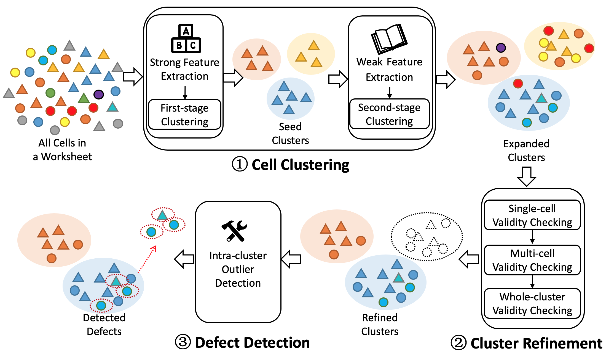

# SGuard Homepage

## Introduction

### End-users' puzzle

Nowadays, spreadsheets (e.g., Excel, Google Sheets) are being widely used in many fields, such as, corporate reporting, financial statistics, etc. However, spreadsheets are found to be error-prone, especially for their formula-related cells. These errors (namely, spreadsheet defects) are hard to detect, since spreadsheets are usually not supported by auditing and tracking services and semantic relationships among spreadsheet cells are typically vague.

### Our solution

Our tool SGuard can effectively detect such spreadsheet defects. As shown in the workflow figure below, SGuard learns spreadsheet features to cluster cells with similar computational semantics, and then refine these clusters to recognize anomalous cells as defects. SGuard well balances the trade-off between the precision (87.8%) and recall rate (71.9%) in the defect detection, and achieves an F-measure of 0.79 on selected spreadsheets from the EUSES corpus. 

## Usage

### Prerequisites

We have released our tool SGuard as an executable jar file and tested it on Windows 10 installed with Java 8. For  full functionality, we strongly encourage users to execute SGuard on Windows, since its partial functionality need platform-dependent DLL files used by the Z3 constraint solver.

### Demonstration

We briefly introduce SGuard’s usage as below:

1. First, to select a specific Excel spreadsheet file for analysis, a user clicks the “Open Excel File” button in the menu bar and then all its associated worksheets would be listed in the left “Worksheet list” area for watch.
2. After that, the user can select one or multiple spreadsheet defect detection techniques from the right “Internal techs” panel to analyze the worksheets in the opened spreadsheet. Here, note that SGuard not only implemented its own CUSTODES (“CUSTODES” for its published version and “CUST-OPT” for its latest version) and WARDER techniques, but also integrated three existing popular defect detection techniques, i.e., AmCheck, CACheck, and TableCheck, so that its user can easily choose different techniques for comparison.
3. Then, with a worksheet selected from the left panel and (multiple) technique(s) selected from the right panel, the user can click “Start analysis” to start SGuard’s defect detection process. When the analyses are complete, the results (i.e., worksheet with colored annotations) would be shown in the central panel for the selected worksheet.
4. Then one can choose to inspect certain results (cell clusters annotated by different colors or defects annotated by red triangles) by clicking “Defective cells” or “Marked clusters” buttons in the right middle panel.
5. In the “defective cells" part, you can simultaneously select multiple techniques to show all defective cells detected by at least one technique, while in the "marked clusters" part, the clustering result is shown one by one to avoid confusion.
6. Moreover, users can also easily save the detection results (worksheets with annotations) into files by clicking the “Save to files” button for later analyses or reuse. Some logging information would also be shown during the SGuard execution (e.g., “Info” and “Logs” panels) for deeper investigation.

SGuard is fully automated. Everything a user needs is almost one button click.

## Video

We also provide a vivid [video](xx) on YouTube to present our methodology, tool usage, etc.

## Related research work

SGuard's demonstration is submitted to [ASE 2019 Demonstrations Track](https://2019.ase-conferences.org/track/ase-2019-Demonstrations), and this tool itself builds on our previous work, [CUSTODES](https://dl.acm.org/citation.cfm?id=2884796) (ICSE16) and [WARDER](https://cs.nju.edu.cn/changxu/1_publications/QRS19.pdf) (QRS19). For further information about CUSTODES, you can visit another [website](http://sccpu2.cse.ust.hk/custodes/).

## Contact us

If you have any question, please feel free to contact authors via [email](mailto:njulida@outlook.com) or [creating an issue](https://help.github.com/en/articles/creating-an-issue) in this repository.
